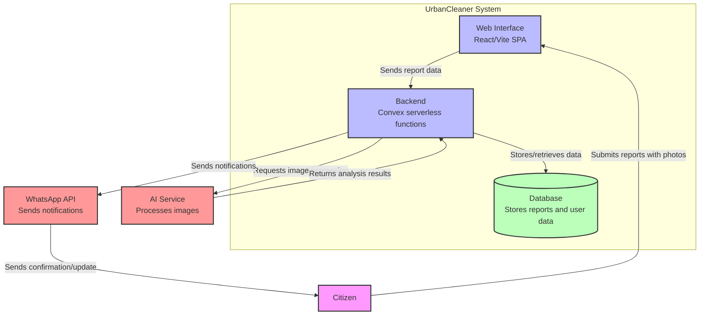
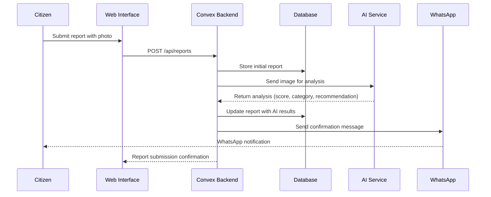
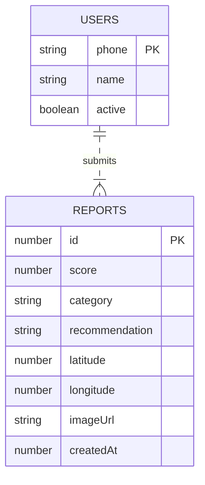
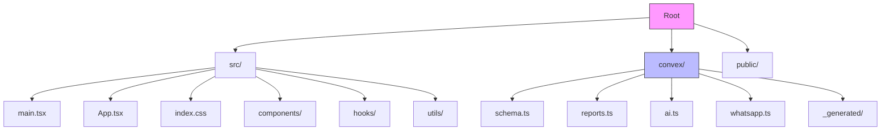

# UrbanCleaner

A React + TypeScript application for reporting and managing urban cleanliness issues with WhatsApp integration.

## Overview

UrbanCleaner enables citizens to report cleanliness issues in their cities through a simple interface, with automated processing via AI and notifications through WhatsApp.

## Architecture



## Data Flow



## Database Schema



## Features

- **Photo Submission**: Users can upload photos of cleanliness issues
- **AI Analysis**: Automatic image processing to categorize issues and provide recommendations
- **WhatsApp Integration**: Real-time notifications and updates via WhatsApp
- **Location Tagging**: GPS coordinates for precise issue reporting
- **Issue Tracking**: Categorization and scoring of reported issues

## Tech Stack

- **Frontend**: React 19 + TypeScript 6 + Vite
- **Styling**: Tailwind CSS 4
- **Backend**: Convex (serverless functions, database, real-time)
- **AI Integration**: External AI service for image analysis
- **Communication**: WhatsApp Business API

## Getting Started

### Prerequisites

- Node.js (v18+)
- npm or yarn
- Convex account
- WhatsApp Business API access
- AI service credentials

### Installation

1. Clone the repository
```bash
git clone <repository-url>
cd UrbanCleaner
```

2. Install dependencies
```bash
npm install
```

3. Configure environment variables
```bash
cp .env.example .env
# Edit .env with your Convex URL and other secrets
```

4. Start development server
```bash
npm run dev
```

## Project Structure



## Development Commands

```bash
npm run dev      # Start development server (http://localhost:5173)
npm run build    # Build for production (tsc -b && vite build)
npm run lint     # Run ESLint
npm run preview  # Preview production build
```

## API Guidelines

### Convex Functions

- **Mutations**: Use `useMutation()` for creating/updating reports
- **Actions**: Use `useAction()` for AI processing and WhatsApp messaging
- **Queries**: Use `useQuery()` for retrieving reports and user data

### Phone Number Format

All phone numbers must follow Indonesian format:
- Must start with `62`
- Example: `628123456789`

## Model Evaluation

### Test Results
- **Test Data**: 32 images (16 clean + 16 dirty)
- **Few-Shot Examples**: 7 images (4 clean + 3 dirty)
- **Accuracy**: 56.25%
- **Precision**: 1.00 (bersih) / 1.00 (kotor)
- **Recall**: 0.38 (bersih) / 0.75 (kotor)
- **F1-Score**: 0.55 (bersih) / 0.86 (kotor)

### Confusion Matrix
|        | Predicted Bersih | Predicted Kotor |
|--------|-----------------|-----------------|
| Actual Bersih | 6 | 0 |
| Actual Kotor  | 0 | 12 |

**Note**: Model tends to classify borderline cases as "sedang" instead of extreme categories.

## Testing the Model

Run evaluation script:
```bash
python scripts/test_model_fast.py
```

This will:
- Load 7 few-shot examples (4 clean + 3 dirty)
- Test on 32 images from `dataset_training/test/`
- Output metrics to `scripts/output/metrics.json`
- Generate visualization graphs in `scripts/output/evaluation_results.png`

## Few-Shot Learning

UrbanCleaner uses **Mistral Pixtral-12b-2409** with few-shot prompting:

- **API Limit**: Maximum 8 images per request (7 examples + 1 test image)
- **Examples Used**: 4 clean + 3 dirty images
- **Approach**: Model learns from examples without fine-tuning

**Benefits**:
- No model training required
- Flexible category definitions
- Quick iteration on examples

**Categories**:
- `bersih`: Score 70-100
- `sedang`: Score 40-69
- `kotor`: Score 0-39

## Unused Files

The following files are not used in the project and can be deleted:

```
scripts/
├── test_model.py           # Broken (truncated base64)
├── new_examples.txt        # Intermediate file (581KB)
├── prompt_examples.json    # Intermediate file (469KB)
├── training_data.jsonl     # Intermediate file (2.8MB)
├── generate_examples.cjs   # Duplicate of .py
├── add_examples_to_ai.cjs  # Helper script
├── reduce_examples.cjs     # Helper script
├── update_ai_examples.cjs  # Helper script
├── update_ai_ts.cjs        # Duplicate of .py
├── upload_and_train.py    # Not used (for model training)
├── check_status.py        # Not used (for model training)
└── prepare_data.py        # Not used (for model training)
```

## Contributing

1. Fork the repository
2. Create your feature branch (`git checkout -b feature/amazing-feature`)
3. Commit your changes (`git commit -m 'Add amazing feature'`)
4. Push to the branch (`git push origin feature/amazing-feature`)
5. Open a Pull Request

## License

This project is licensed under the MIT License - see the LICENSE file for details.

## Last Updated

May 1, 2026
