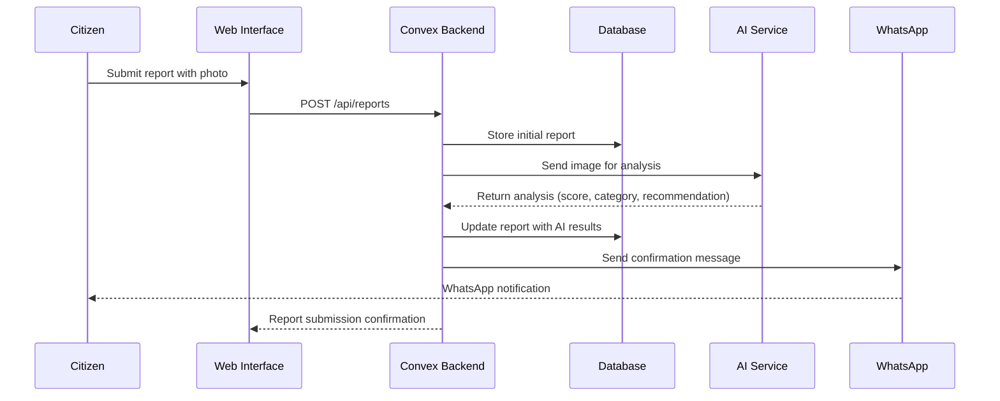
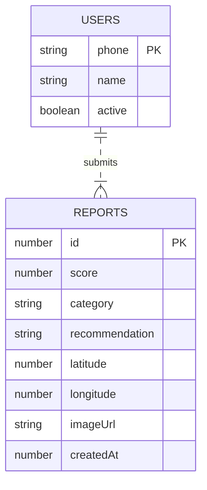
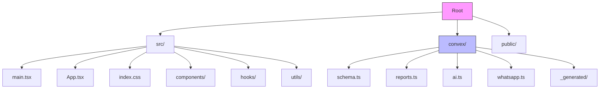

# UrbanCleaner

A React + TypeScript application for reporting and managing urban cleanliness issues with WhatsApp integration.

## Overview

UrbanCleaner enables citizens to report cleanliness issues in their cities through a simple interface, with automated processing via AI and notifications through WhatsApp.

## Architecture

```mermaid
C4Context
    title System Context Diagram for UrbanCleaner
    
    Person(user, "Citizen", "Reports cleanliness issues")
    System_Boundary(b1, "UrbanCleaner System") {
        System(ui, "Web Interface", "React/Vite SPA for submitting reports")
        System(api, "Backend", "Convex serverless functions")
        SystemDb(db, "Database", "Stores reports and user data")
        System_Ext(ai, "AI Service", "Processes images and generates recommendations", technology="External AI")
        System_Ext(whatsapp, "WhatsApp API", "Sends notifications", technology="WhatsApp Business API")
    }
    
    Rel(user, ui, "Submits reports with photos", "HTTPS")
    Rel(ui, api, "Sends report data", "HTTPS")
    Rel(api, db, "Stores/retrieves data", "Database")
    Rel(api, ai, "Requests image processing", "HTTPS")
    Rel(ai, api, "Returns analysis results", "HTTPS")
    Rel(api, whatsapp, "Sends notifications", "HTTPS")
    Rel(whatsapp, user, "Sends confirmation/update", "WhatsApp")
```

## Data Flow



## Database Schema



## Features

- **Photo Submission**: Users can upload photos of cleanliness issues
- **AI Analysis**: Automatic image processing to categorize issues and provide recommendations
- **WhatsApp Integration**: Real-time notifications and updates via WhatsApp
- **Location Tagging**: GPS coordinates for precise issue reporting
- **Issue Tracking**: Categorization and scoring of reported issues

## Tech Stack

- **Frontend**: React 19 + TypeScript 6 + Vite
- **Styling**: Tailwind CSS 4
- **Backend**: Convex (serverless functions, database, real-time)
- **AI Integration**: External AI service for image analysis
- **Communication**: WhatsApp Business API

## Getting Started

### Prerequisites

- Node.js (v18+)
- npm or yarn
- Convex account
- WhatsApp Business API access
- AI service credentials

### Installation

1. Clone the repository
```bash
git clone <repository-url>
cd UrbanCleaner
```

2. Install dependencies
```bash
npm install
```

3. Configure environment variables
```bash
cp .env.example .env
# Edit .env with your Convex URL and other secrets
```

4. Start development server
```bash
npm run dev
```

## Project Structure



## Development Commands

```bash
npm run dev      # Start development server (http://localhost:5173)
npm run build    # Build for production (tsc -b && vite build)
npm run lint     # Run ESLint
npm run preview  # Preview production build
```

## API Guidelines

### Convex Functions

- **Mutations**: Use `useMutation()` for creating/updating reports
- **Actions**: Use `useAction()` for AI processing and WhatsApp messaging
- **Queries**: Use `useQuery()` for retrieving reports and user data

### Phone Number Format

All phone numbers must follow Indonesian format:
- Must start with `62`
- Example: `628123456789`

## Contributing

1. Fork the repository
2. Create your feature branch (`git checkout -b feature/amazing-feature`)
3. Commit your changes (`git commit -m 'Add amazing feature'`)
4. Push to the branch (`git push origin feature/amazing-feature`)
5. Open a Pull Request

## License

This project is licensed under the MIT License - see the LICENSE file for details.

## Last Updated

April 29, 2026